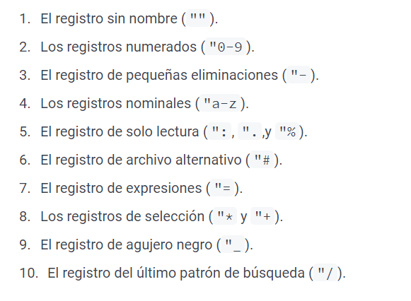

# COURSE-VIM-NOTES
---
## BUSQUEDA
- Aquí tienes un **truco extra** al utilizar el manual de la ayuda de Vim: supón que quieres aprender más sobre lo que hace `Ctrl-P` en el modo insertar. Si solo buscas `:h CTRL-P`, te enviará a lo que hace `Ctrl-P` en el modo normal. Esa no es la ayuda sobre `Ctrl-P` que estabas buscando. En este caso, deberás buscar esto `:h i_CTRL-P`. El prefijo `i_` representa al modo insertar. Pon atención sobre a qué modo pertenece lo que andas buscando.

## _VIMRC
- Supongamos que necesitamos configurar las **opciones de numeración de línea** (set number). Si todavía no tienes un **archivo vimrc**, vamos a crear uno. Normalmente este archivo tendrá el nombre de `.vimrc` y se ubica en la raíz del directorio personal del usuario del sistema. Dependiendo de tu sistema operativo, la ubicación puede ser diferente. En sistemas basados en Unix como GNU/Linux o macOS estará en` ~/.vimrc`. Para ver donde deberías ubicar tu archivo, echa un vistazo a :h vimrc.
- Dentro del archivo añade una línea con lo siguiente ``set number``. Guárdalo (:w) y después haz que Vim lo tenga en cuenta ejecutando `:source %`. Ahora deberías ver los números de línea mostrados en el margen izquierdo.
    - De manera alternativa, si no quieres realizar cambios en los ajustes que se guarden de forma permanente, siempre puedes ejecutar el comando set en la línea de comandos, ejecutando ``:set number``. La contrapartida de este método es que estos ajustes son temporales. Cuando cierres Vim los cambios y opciones desaparecen

## CAPITULO 1: EJECUTANDO VIM
***

### GUARDANDO UN FICHERO
- También puedes escribir ``:w`` de forma abreviada. Si este es un archivo nuevo, necesitarás darle un nombre antes de **guardarlo**. Vamos a llamarlo archivo.txt. Ejecuta: ``:w archivo.txt``

### ABRIENDO UN ARCHIVO
- Desde la terminal, para **abrir** el archivo hola1.txt, ejecuta: ``vim hola1.txt``
- También puedes **abrir varios archivos** a la vez: ``vim hola1.txt hola2.txt hola3.txt``

### VER VERSION
- Para comprobar la version actual de vim en la **terminal** ``vim --version``
- Para ver la version actual **dentro** de vim ``:version``

### LINEA DE COMANDOS
- Para explorar el **historial** de la linea de comandos escribimos ``:history``
    - Para que el comando funciones, vim necesite la **funcionalidad** ``+cmdline_history``
#### EJEMPLO 
-  En Vim, puedes **sustituir** texto con el comando ``:s`` (abreviatura de :substitute). Si quieres abrir ``hola.txt`` y sustituir todo el texto *"donut"* con *"rosquilla"*, ejecuta:``vim +%s/donut/rosquilla/g hola.txt``

- También puedes añadir la opción ``-c`` seguida de un comando de Vim en vez de la sintaxis ``+``:
#### EJEMPLO 
`` vim -c %s/tarta/rosquilla/g hola.txt ``
``vim -c %s/tarta/rosquilla/g -c %s/rosquilla/huevo/g -c %s/huevo/donut/g hola.txt``

### ABRIENDO MULTIPLES VENTANAS
- Abrir  **ventanas horizontales**
    -  Para abrir Vim con 5 ventanas horizontales y ocupar las dos primeras con los archivos ``hola1.txt`` y ``hola2.txt``, ejecuta: ``vim -o5 hola1.txt hola2.txt``
- Abrir **ventanas verticales**
    - Para abrir Vim con 2 ventanas verticales ``vim -O2``

### SUSPENDER
- Vim se ejecuta en segundo plano, puedes presionar la combinación de teclas ``Ctrl-z``. También puedes ejecutar los comandos ``:stop`` o ``:suspend``. Para volver a retomar la sesión suspendida de Vim, ejecuta ``fg`` desde la terminal.

## CAPITULO2: BUFFERS, VENTANAS Y PESTANAS
---
### BUFFERS
#### QUE SON LOS BUFFERS
- Espacio en la memoria en el que puedes escribir y editar algún texto
- Al abrir vim abres un buffer
EJEMPLO 
    - Cuando presiono ``vim index1.html index2.html`` se me **abren** 2 buffers
- Puedes **mostrar** todos los buffers mediante el comando ``:buffers`` (también puedes usar ``:ls`` o ``:files``).

#### FORMAS DE DESPLAZARSE EN LOS BUFFERS
IR AL SIGUIENTE O PREVIO BUFFER

- ``:bnext`` o de manera **abreviada** puedes utilizar ``:bn`` para ir al **buffer siguiente** (``:bprevious`` o ``:bp`` para ir al **buffer previo**).

IR A UN BUFFER BUSCANDO POR SU NOMBRE
    
- ``:buffer + nombre_de_archivo``. De manera **abreviada** puedes utilizar ``:b``. Vim puede autocompletar el nombre de archivo con Tab.

BUSCAR UN BUFFER POR SU NUMERO
    
- ``:buffer + n``, donde n es el número del buffer. También puedes reemplazar ``:buffer`` por ``:b``. Por ejemplo, escribiendo: ``:buffer 2`` o ``:b 2`` te llevará al buffer número 2.

SALTAR DIFFERNTES BUFFERS

- Salta a la antigua posición en la lista de saltos con ``Ctrl-O`` y a la nueva posición con ``Ctrl-I``. (Estos no son métodos específicos para buffers, pero pueden ser utilizados para saltar entre diferentes buffers. Explicaré más detalles sobre los saltos en el capítulo 5.)

IR A UN BUFFER PREVIAMENTE EDITADO
    
- Ir al buffer previamente editado con ``Ctrl-^``.

#### ELIMINAR BUFFERS
- Para eliminar el buffer en el que estas actualmente presiona ``:bdelete`` 
    - Este comando puede seguir luego del numero del buffer. Ej ``bdelete 3`` o el nombre 
    del arhivo Ej `:bdelete buffer_name``

### LEAVE OUT VIM
- Cerrar todos los buffers a la vez ``:qall``
- Cerrar todos los buffers sin guardar cambios ``:qall!``
- Guardar y salir ``:wqall``

### WINDOWS
#### QUE ES UNA VENTANA
- Una ventana es una división gráfica en un buffer

#### ATAJOS
``split nombre_del_archivo`` abre una ventana **horizontalmente**
``vsplit nombre_del_archivo`` abre una ventana **verticalmente**
``Ctrl-W H ``   Mueve el cursor a la ventana de la **izquierda**
``Ctrl-W J ``  Mueve el cursor a la ventana **inferior**
``Ctrl-W K``Mueve el cursor a la ventana **superior**
``Ctrl-W L``    Mueve el cursor a la ventana de la **derecha**
``:buffer nombre_del_archivo`` Para **cambiar** de buffer en una misma ventana
``:new nombre_de_archivo ``      Crea una **nueva ventana**
``:quit`` **Cerrar una ventana**
``:h window`` Para **mas informacion**
- En el modo normal 
``Ctrl-W V ``   Abre una nueva **división vertical**
``Ctrl-W S``    Abre una nueva **división horizontal**
``Ctrl-W C``    **Cierra** una ventana
``Ctrl-W O ``   Hace que la **ventana actual** sea la **única** en la pantalla y cierra las demás ventanas

### TABS 
- Una pestaña en una **colección de ventana**
- Cuando cierras una pestaña en Vim, **no estás cerrando un archivo**. Recuerda, Vim almacena los archivos en la memoria mediante los buffers. Cerrar una pestaña (o una ventana) no hace que ese archivo desaparezca, todavía permanecen abierto en de los buffers.
#### COMANDOS
``:tabnew archivo.txt``    Abre archivo.txt en una **nueva pestaña**
``:tabclose``              Cierra la **pestaña actual**
``:tabnext``            Ir a la **próxima pestaña**
``:tabprevious``        Ir a la **pestaña previa**
``:tablast``            Ir a la **última pestaña**
``:tabfirst``           Ir a la **primera pestaña**
``gt``  **Moverse** entre pestanas (puede ir acompanado con el numero de buffer)
``vim -p archivo1.js archivo2.js archivo3.js`` **Arrancar** vim con multiples pestanas

**OJO** Tmux no es igual a pestanas
## CAPITULO3: SEARCH FILES 
***
``:edit archivo.txt`` To **open** a file 
>We can use ``*`` as a wildcard
EXAMPLE 
``:edit *.yml<Tab>`` vim will show all the files that contain ``.yml`` extension

>To search even inside your files to your project you can use ``**``. You can move through the files that have the similiar filters  with ``<tab>``
EXAMPLE 
``:edit **/*.md<Tab>`` In this example we are going inside of one of our files and we are searching all the markdown files that are inside this file

>We can use vim file explorer named ``netrw`` to the following ways
``:edit .`` To open netrw in a current file
``:edit name_file`` To open netrw in a scpecific file

### Find and Path 
To difference to ``:edit`` ``:find`` allow to you to specify in what files do you want to do a research. For example if you want research ``sport.txt`` in only ``/carpet1`` and   ``/carpet2``, you can do it using ``find``

To save the directories that you want to do the research, we use the command ``path``

``:set path?``To see the directories saved 

``,`` Is a caracter that separated each directory saved

``.``Is to related to the currency file

``:set path+=$PWD/**`` To attach all the file that you have in the currency directory to the path

``:set path-=`` To remove the current directory use

``:set path+=``To add the current directory use

``:set path=.`` To search relative to the directory of the current file

``:set path=,,``To search in the current directory use an empty string between two commas. 
> You can see the difference between to two last clicking on the following link 
[link to see the difference](https://thunder-giraffe-8fd.notion.site/set-path-don-t-store-your-paths-when-you-leave-vim-e59002ef35144a23813c192db4eb184f)
### GREP
- Search **phrases** in a differents files 
#### EXTERNAL GREP
- It has the following **sintaxis**  ``:vim /patrón/ archivo``
EXAMPLE 
    - If we want to search all the **file that contains the character** ``hola``, you can do
    that writing the following  ``:vim hola name_to_file``
    - We can include **wildcards** Ej ``:vim hola VIM_COURSE/*``,``:vim hola VIM_COURSE/**.txt``,etc
-  To see all the results we can use quickfix. There are some commands to use this: 
``:copen ``       **Abrir** la ventana quickfix
``:cclose``      **Cerrar** la ventana quickfix
``:cnext``        Ir al **siguiente** error
``:cprevious ``   Ir al error **anterior**
``:colder  ``     Ir a la lista de errores **mas antigua**
``:cnewer``       Ir a la lista de errores **mas nueva**
#### INTERNAL GREP
- You can see the structure clicking the following link: 
[link to see the estructure](https://thunder-giraffe-8fd.notion.site/GREP-dc7059cf7604412281e57d8d831c4aa1)
#### NETRW
- At the same you open vim, you can start netrw
```
vim .   To the file when you are
vim src/client/  To your selected file
:Explore     Inicia netrw en el archivo actual
:Sexplore    No es broma. Inicia netrw en una pantalla dividida en la mitad superior
:Vexplore    Inicia netrw en una pantalla dividida en la mitad izquierda
%    Crear un nuevo archivo
d    Crear un nuevo directorio
R    Renombra un archivo o directorio
D    Elimina un archivo o directorio
```
- On this, you can use **vim movements**
- If you other **alternative**, you can use nerdtree
## CAPITULO4: LA GRAMATICA DE VIM'
### SUSTANTIVOS(MOVIMIENTOS)
```
h    Izquierda
j    Abajo
k    Arriba
l    Derecha
w    Mover el cursor hacia adelante al principio de la palabra siguiente
}    Saltar al siguiente párrafo
$    Ir al final de la línea
```
### VERBOS(OPERADORES)
```
y    **Copiar** un texto (*yank* en Vim sería la acción de copiar, de ahí la letra `y`)
d    **Eliminar** un texto y guardarlo en el registro (*delete* en Vim sería la acción de eliminar, de ahí la letra `d`)
c    **Eliminar** un texto, guardarlo en el registro y comenzar en el modo de insertar
```
### OBJETOS DE TEXTO (mas sustantivos)
- Selecciona un objeto entre parentesis y lo elimina. Lo puede hacer de las siguietnes formas 
```
i + objeto    Dentro del objeto de texto
a + objeto    Fuera del objeto de texto
```
EJEMPLO 
```
const hello = function() {
  console.log("Hello Vim");
  return true;
}
```
- Para eliminar por completo el texto **"Hello Vim"**: di(.
- Para eliminar el contenido de la **función (rodeado por {})**: di{.
- Para eliminar la palabra **"Hello"**: diw.

LISTA DE OBJETOS 
```
w         Una palabra
p         Un párrafo
s         Una frase (*sentence* en inglés)
( o )     Un par de ( )
{ o }     Un par de { }
[ o ]     Un par de [ ]
< o >     Un par de < >
t         Etiquetas XML (*tags* en inglés)
"         Un par de " "
'         Un par de ' '
`         Un par de ` `
```
## CAPITULO5: MOVIENDOTE POR UN ARCHIVO 
- Teclas de movimiento 
```
h   Izquierda
j   Abajo
k   Arriba
l   Derecha

```
```
w     Mueve el cursor hacia adelante al comienzo de la siguiente palabra
W     Mueve el cursor hacia adelante al comienzo de la siguiente PALABRA
e     Mueve el cursor hacia adelante una palabra hasta el final de la siguiente palabra
E     Mueve el cursor hacia adelante una palabra hasta el final de la siguiente PALABRA
b     Mueve el cursor hacia atrás al principio de la palabra previa
B     Mueve el cursor hacia atrás al principio de la PALABRA previa
ge    Mueve el cursor hacia atrás al final de la palabra previa
gE    Mueve el cursor hacia atrás al final de la PALABRA previa
```

Entonces, ¿cuáles son las similitudes y diferencias entre una palabra y una PALABRA? Tanto una palabra como una PALABRA están separadas por espacios en blanco. Una palabra es una secuencia de caracteres que contienen únicamente este grupo de caracteres `a-zA-Z0-9_`. Una PALABRA es una secuencia que incluyen todos los caracteres excepto el espacio en blanco (cuando me refiero a espacio en blanco, esto incluye tanto un espacio, una separación por tabulador o un fin de línea)

```
f    Busca hacia adelante una coincidencia en la línea actual
F    Busca hacia atrás una coincidencia en la línea acual
t    Busca hacia adelante una coincidencia en la línea actual, posicionando el cursor antes de la coincidencia
T    Busca hacia atrás una coincidencia en la línea actual, posicionando el cursor antes de la coincidencia
;    Repite la última búsqueda en la línea actual en la misma dirección
,    Repite la última búsqueda en la línea actual en dirección contraria
```


- Para inhabilitar las direccionales del teclado escribir el siguiente codigo:
```
noremap <Up> <NOP>
noremap <Down> <NOP>
noremap <Left> <NOP>
noremap <Right> <NOP>
```

### NAVEGACION EN UNA FRASE O PARRAFO

NAVEGACION EN UNA FRASE
```
(    Salta a la frase previa
)    Salta a la siguiente frase
```
NAVEGACION EN UN PARRAFO
Un párrafo comienza después de cada línea vacía y también en cada conjunto de una macro de párrafo especificada por los pares de caracteres en la opción de párrafos.

```
{    Salta al párrafo previo
}    Salta al párrafo siguiente
```

### NAVEGACION DE PAREJAS 
```%    Navega de una a otra pareja, normalmente funciona con (), [], {}```

### NAVEGACION POR NUMERO DE LINEA
```
gg    Va a la primera línea (o 1G)
G     Va a la última línea
nG    Va a la línea n
n%    Va al n% del archivo
```
- Ver el numero de lineas de un archivo se utiliza `CTRL-g`

### NAVEGACION POR LA VENTANA 
```
H     Ir a la parte superior de la ventana
M     Ir a la parte media de la ventana
L     Ir a la parte inferior de la ventana
nH    Va a la línea n desde la parte superior de la ventana
nL    Va a la línea n desde la parte inferior de la ventana
```
### DESPLAZANDOSE
```
Ctrl-E    Desplaza el texto hacia arriba una línea
Ctrl-D    Desplaza media pantalla hacia arriba
Ctrl-F    Desplaza una pantalla completa hacia arriba el texto
Ctrl-Y    Desplaza el texto hacia abajo una línea
Ctrl-U    Desplaza media pantalla hacia abajo
Ctrl-B    Desplaza una pantalla completa hacia abajo el texto
```

```
zt    LLeva la línea actual donde está el cursor cerca de la parte superior de la pantalla
zz    LLeva la línea actual donde está el cursor a la parte media de la pantalla
zb    LLeva la línea actual donde está el cursor cerca de la parte inferior de la pantalla
```
### NAVEGACION POR BUSQUEDA 
```
/    Busca hacia adelante una coincidencia
?    Busca hacia atrás una coincidencia
n    Repite la última búsqueda (en la misma dirección que la búsqueda previa)
N    Repite la última búsqueda (en la dirección opuesta que la búsqueda previa)
```

```
*     Busca la palabra completa bajo el cursor hacia adelante
#     Busca la palabra completa bajo el cursor hacia atrás
g*    Busca la palabra bajo el cursor hacia adelante
g#    Busca la palabra bajo el cursor hacia atrás
```
### MARCAR POSICION

Puedes utilizar marcas para guardar la posición actual del cursor y poder volver a esa posición más tarde. 

Es como un marcador para la edición de texto. Puedes establecer un marcador con ``mx``, donde ``x`` puede ser cualquier letra del alfabeto```a-z A-Z``. 

- Existen dos maneras de volver a la marca establecida: de manera exacta (línea y columna) mediante ```x`` y a la línea con ``'x``.


```
ma    Marca una posición, estableciendo la marca "a" en la posición actual del cursor
`a    Salta a la línea y columna donde se encuentra "a"
'a    Salta a la línea donde se encuentra "a"
```

```
''    Salta hacia atrás a la última línea donde se encontraba el cursor en el *buffer* actual antes de saltar
``    Salta hacia atrás a la última posición en el *buffer* actual a la última posición en el *buffer* actual antes de saltar
`[    Salta al comienzo del texto previamente cambiado / pegado
`]    Salta al final del texto previamente cambiado / pegado
`<    Salta al comienzo de la última selección visual
`>    Salta al final de la última selección visual
`0    Salta hacia atrás al último archivo editado cuando salió de Vim
```

### COMANDOS DE SALTO
```
'       Ir a la línea marcada
`       Ir a la posición marcada
G       Ir a la línea
/       Buscar hacia adelante
?       Buscar hacia atrás
n       Repetir la úlrima búsqueda, en la misma dirección
N       Repetir la última búsqueda, en la dirección opuesta
%       Encontrar la pareja
(       Ir a la frase anterior
)       Ir a la frase siguiente
{       Ir al párrafo anterior
}       Ir al párrafo siguiente
L       Ir a la última línea mostrada en la ventana
M       Ir a la línea media mostrada en la ventana
H       Ir a la línea superior mostrada en la ventana
[[      Ir a la sección previa
]]      Ir a la sección siguiente
:s      Substituir
:tag    Saltar a la etiqueta de definición
```

Existe una diferencia entre establecer marcas con letras minúsculas (a-z) y mayúsculas (A-Z). Las marcas con letras minúsculas, son marcas locales y las marcas con letras mayúsculas son marcas globales (a veces conocidas como marcas de archivo).

## CAPITULO6: EL MODO INSERTAR 
### ENTRAR EL MODO INSERTAR
- Formas de ingresar al modo insertar 
```
i    Inserta texto antes del cursor
I    Inserta texto antes del primer carácter que no sea un espacio en blanco de la línea
a    Añadir texto después del cursor
A    Añadir texto al final de la línea
o    Crea una nueva línea debajo del cursor y cambia al modo insertar
O    Crea una nueva línea encima del cursor y cambia al modo insertar
s    Elimina el carácter debajo del cursor e inserta texto (sustituye texto)
S    Elimina la línea actual e inserta texto (sustituye toda la línea)
gi   Inserta texto en la misma posición donde el modo insertar fue detenido por última vez en el *buffer* actual
gI   Inserta texto al comienzo de una línea (columna 1)
```
### SALIR DEL MODO INSERTAR
- Formas de salir del modo insertar 
```
<Esc>    Salir del modo insertar y volver al modo normal
Ctrl-[   Salir del modo insertar y volver al modo normal
Ctrl-C   Similar a Ctrl-[ y <Esc>, pero no controla las abreviaciones
```
### NUMERO Y EL MODO INSERTAR
- Cuando antes del modo insertar pones un **numero** y haces una accion como escribir `hola mundo`, entonces la accion se repetira 
segun el numero que hayas puesto. Por ejemplo `3i` 

OJO 
- Para pegar lo que tienes almacenado en un registro mientras estamos en el modo insertar escribimos `CTRL-R` mas el registro. Si por ejemplo 
queremos pegar lo que tengamos en el registro  a escribimos `CTRL-R a`

### HACER SCROLL 
- Mientras estamos en el modo insertar
```
Ctrl-x Ctrl-Y    Desplaza el contenido de la pantalla hacia arriba
Ctrl-x Ctrl-E    Desplaza el contenido de la pantalla hacia abajo
```
### AUTOCOMPLETADO
```
Ctrl-x Ctrl-L       Inserta una línea completa
Ctrl-x Ctrl-N       Inserta un texto desde el archivo actual
Ctrl-x Ctrl-I       Inserta un texto desde los archivos incluidos
Ctrl-x Ctrl-F       Inserta un nombre de archivo
```
- Vim también tiene dos auto completados que no utiliza el submodo Ctrl-x:
```
Ctrl-N             Encuentra la siguiente palabra que coincide
Ctrl-P             Encuentra la palabra anterior que coincide
```
## CAPITULO7: EL COMANDO DEL PUNTO 
- Como repetir una accion
Repetiremos la accion de cambiar una palabra por otra 
1. Buscar una palabra con ``\`` 
2. Escribir ``cw(palabra a reemplazar)``
3. ``n`` Para encontrar la siguiente coincidencia 


## CAPITULO8: REGISTROS
- Los registros son 
 
### Operadores de registros 

### Llamando registros desde el modo insertar 
### Registros sin nombre 
### Registros numerados 
REGISTROS DE COPIA 
REGISTROS NUMERADOS 
### Registro de borrado 
### Registros nominales 
### Registros de solo lectura 
### Registros de expresiones 
### Registros de seleccion 
### Registros de agujero negro 
### Registro del ultimo patron de busqueda 
### Acciones con los registros 
VER REGISTROS 
EJECUTANDO UN REGISTRO 
LIMPIAR EL CONTENIDO DE UN REGISTRO 
PEGAR EL CONTENIDO DE UN REGISTRO 
 
## CAPITULO9: MACROS 
## CAPITULO10: DESHACER 
## CAPITULO11: MODO VISUAL
## CAPITULO12: BUSCAR Y SUSTITUIR 
## CAPITULO13: EL COMANDO GLOBAL
## CAPITULO14: COMANDOS EXTERNOS 
## CAPITULO15: EL MODO DE LINEA DE COMANDO 
## CAPITULO16: ETIQUETAS
## CAPITULO17: PLEGADO DE TEXTO(FOLD)
## CAPITULO18: GIT 
## CAPITULO19: COMPILAR
## CAPITULO20: VISTAS SESIONES Y VIMINFO
## CAPITULO21: OPERACIONES EN MULTIPLES ARCHIVOS 
## CAPITULO22: VIMRC
## CAPITULO23: EL GESTOR DE COMPLEMENTOS DE VIM(PACKAGES)
## CAPITULO24: LOS EJECUTABLES(RUNTIME) DE VIM
## CAPITULO25: TIPOS DE DATOS BASICOS DE VIMSCRIPT 
## CAPITULO26: CONDICIONALES Y BUCLES EN VIMSCRIPT 
## CAPITULO27: VARIABLES DE VIMSCRIPT Y SU AMBITO 
## CAPITULO28: FUNCIONES DE VIMSCRIPT 
## CAPITULO29: EJEMPLO DE COMO ESCRIBIR TU PROPIO COMPLEMENTO DE VIM
